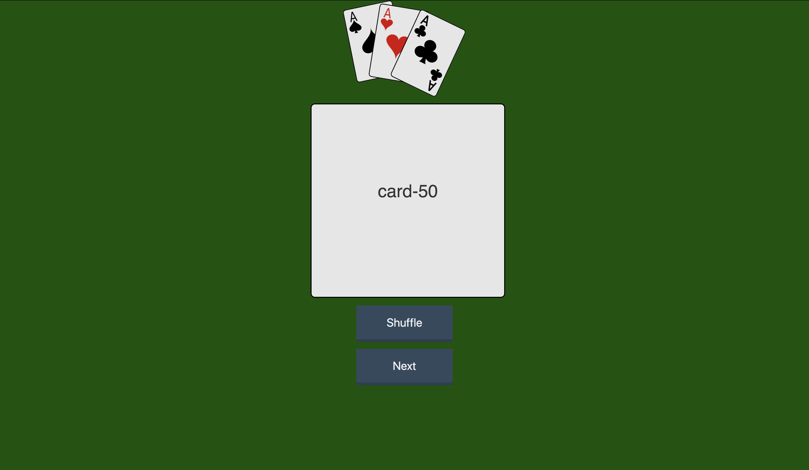

# 52Components

A simple ReactJs application simulating a deck of cards, soon to have full shuffle and draw funtionality. 

## How to use:

Clone the repo in to your local machine using terminal in Mac or the cmd application in Windows with the command: 
<pre>git clone</pre>

After, navigate into the cloned directory and start the application with the command: 
<pre>npm start https://github.com/tone2k/react-challenge.git</pre>

Once the application is started, your browser should open rendering the page (shown below)

Choose Shuffle to shuffle the deck and draw a card and Next to bring the following card sorted. 

### Screenshots
Landing Page:

#### Look out for V2!

Improved enzyme component testing, functional next button for consecutive card draws, and improved UI UX!

